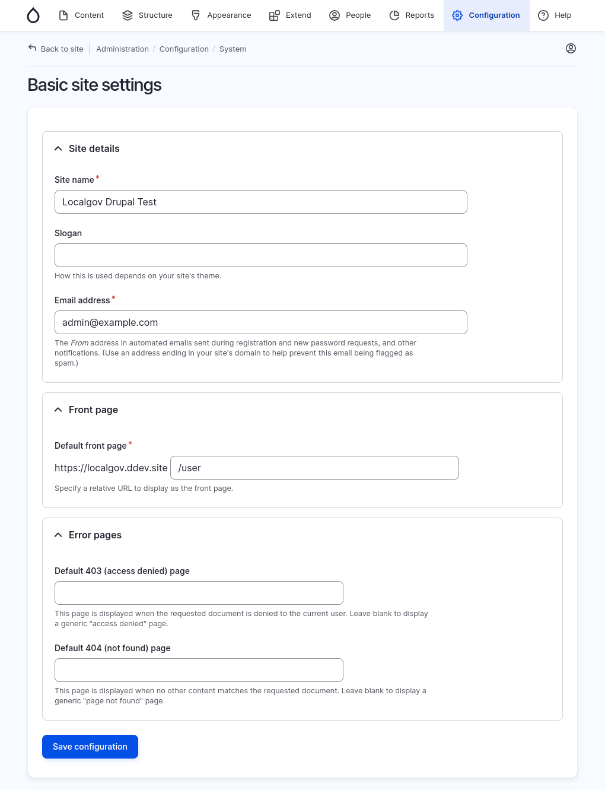
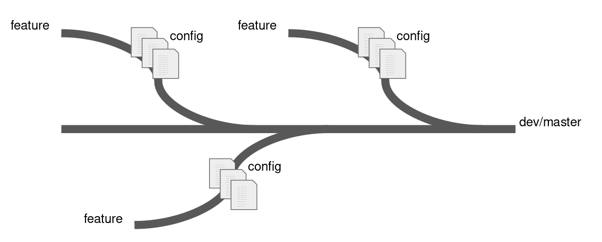

# Drupal Configuration
## Phil Norton
<span class="small-text">Developer
Code Enigma</span>
<!-- Speaker notes will appear here. -->

---

# What is configuration?
- Drupal stores its internal structure using configuration.
- This governs how a site is put together.
- Modules can plug into this and define their own config.
- Configuration to be used to set up sites in a particular way.
- Stored in the database, can be exported as yaml files.

---

# What is configuration?

Configuration is part of the different data types available in Drupal.

---

# Types Of Data In Drupal 10

| Data type | Example |
| --- | --- |
| Content | Blog post, taxonomy term, etc |
| Session | Logged in status, shopping carts, etc |
| State | Last cron run, thid party API authentication details, etc |
| Configuration | Site name, entity types, etc |

---

# Example Configuration

---

## Basic Site Settings

- The Drupal <mark>Basic site settings</mark> form is a configuration form.
- Located at `Configuration > System > Basic site settings`
- Controls the site nane, slogan, email address, front page and error pages.



---

## Basic Site Settings

- When saved, this form will create a configuration entity in the database.

```
> select * from config where name = 'system.site' limit 1\G
*************************** 1. row ***************************
collection: 
      name: system.site
      data: a:10:{s:5:"_core";a:1:{s:19:"default_config_hash";
      s:43:"yTxtFqBHnEWxQswuWvkjE8mKw2t8oKuCL1q8KnfHuGE";}s:8:
      "langcode";s:5:"en-gb";s:4:"uuid";s:36:"b4b044db-a187-486
      8-bf26-b6861747a1d5";s:4:"name";s:20:"Localgov Drupal Tes
      t";s:4:"mail";s:17:"admin@example.com";s:6:"slogan";s:0:"
      ";s:4:"page";a:3:{i:403;s:0:"";i:404;s:0:"";s:5:"front";s
      :5:"/user";}s:18:"admin_compact_mode";b:0;s:17:"weight_se
      lect_max";i:100;s:16:"default_langcode";s:5:"en-gb";}

```

---

## Basic Site Settings

<!-- _footer: '' -->
```
Array
(
    [_core] => Array
        (
            [default_config_hash] => yTxtFqBHnEWxQswuWvkjE8mKw2t8oKuCL1q8KnfHuGE
        )

    [langcode] => en-gb
    [uuid] => b4b044db-a187-4868-bf26-b6861747a1d5
    [name] => Localgov Drupal Test
    [mail] => admin@example.com
    [slogan] => 
    [page] => Array
        (
            [403] => 
            [404] => 
            [front] => /user
        )

    [admin_compact_mode] => 
    [weight_select_max] => 100
    [default_langcode] => en-gb
)
```

---

## Basic Site Settings

```
    [name] => Localgov Drupal Test
    [mail] => admin@example.com
    [slogan] => 
    [page] => Array
        (
            [403] => 
            [404] => 
            [front] => /user
        )
```


---

# Is It Configuration?

Now that we know a little about configuration, let's have a <mark>quiz</mark>!

---

# The Site Name

<div data-marpit-fragment>

Configuration!
<span class="green-tick">✅</span>

</div>

---

# A Blog Content Type

<div data-marpit-fragment>

Configuration!
<span class="green-tick">✅</span>
</div>

---

# A Blog Post

<div data-marpit-fragment>

Not configuration, this is content
<span class="red-cross">❌</span>

</div>

---

# Permissions

<div data-marpit-fragment>

They are a form of plugin.
<span class="red-cross">❌</span>

</div>

---

# A User
<div data-marpit-fragment>

This is content
<span class="red-cross">❌</span>

</div>

---

# User Roles

<div data-marpit-fragment>

Configuration!
<span class="green-tick">✅</span>

</div>

---

# A User's Roles

<div data-marpit-fragment>

This is content.
<span class="red-cross">❌</span>

</div>

---

# A User's Session

<div data-marpit-fragment>

Not configuration. This is stored in session management.
<span class="red-cross">❌</span>

</div>

---

# Vocabulary

<div data-marpit-fragment>

Configuration!
<span class="green-tick">✅</span>

</div>

---

# A Taxonomy Term

<div data-marpit-fragment>

This is content.
<span class="red-cross">❌</span>

</div>

---

# A Field On A Content Type

<div data-marpit-fragment>

Configuration!
<span class="green-tick">✅</span>

</div>

---

# A Menu

<div data-marpit-fragment>

Configuration!
<span class="green-tick">✅</span>

</div>

---

# A Menu Item

<div data-marpit-fragment>

Not configuration, this is content.
(For the most part, menus are a form of plugin)
<span class="red-cross">❌</span>

</div>

---

# A Block Content

<div data-marpit-fragment>

Not configuration, this is content.
<span class="red-cross">❌</span>

</div>

---

# Block Placement

<div data-marpit-fragment>

Configuration!
<span class="green-tick">✅</span>

</div>

---

# A View

<div data-marpit-fragment>

Configuration!
<span class="green-tick">✅</span>

</div>

---

There is some overlap between configuration and content

<div class="columns">  
<div>
<strong>Configiration</strong><br><br>
Fields<br>
Vocabulary<br>
Menu<br>
User Roles<br>
Block Placement<br>
Site Settings</div>  
<div><strong>< Overlap ></strong><br><br>Content Filtered Views<br><br>
Default Content<br><br>
Taxonomy Access Control<br><br></div> 
<div>
<strong>Content</strong><br><br>
Users<br>
Blog Post<br>
Taxonomy Term<br>
Menu Item<br>
Block Content<br>
Webform submission</div>
</div>

<!-- Content blocks for example, are not in configuration, but their placement is. -->

--- 

# Working With Configuration

---

## Active Configuration

Drupal will label the configuration based on where it is.
- <mark>Active</mark> = The configuration currently active on the site.
- <mark>Staged</mark> = The configuration on the file system.

<!--
When you import your configuration you are taking the current 'staged' configuration and applying it against your 'active' configuration.
-->

---

# Exporting Configuration

---

## Exporting Configuration

Getting the configuration out of your site can be done in two ways:
- Download direct from site
- Drush export

Drush is the preferred way.

<!-- Drush is preferred as it allows for large configuration exports without putting stress on the web server.
It also can update a directory containing your configuration. -->
---

## Exporting Configuration

First we need to tell Drupal where our configuration will live.

```php
$settings['config_sync_directory'] = '../config/sync';
```

- This is added to your site's settings.php file.
- Drupal will store the configuration outside of the webroot.

(Note that DDEV sets this value to `sites/default/files/sync`)

<!--
Storing the configuration outside of the webroot is a good idea. Some modules will add API credentials to their configuration, which isn't great if that can be viewed.
-->

---

## Exporting Configuration

Via Drush:

`drush config:export`

<!-- DEMO -->

---

# Importing Configuration

---

## Importing Configuration

Importing configuration will take whatever is in your configuration directory and apply it to your site.

- New configuration will be created
- Changed configuration will be applied
- Deleted configuration will be removed*

\* Drupal protects you from deleting configuration that contains content.

<!-- For example, you can't delete a content type that contains pages of content. -->

---

## Importing Configuration

Via Drush:

`drush config:import`

<!-- DEMO -->

---


# Drush Configuration Commands

---

## drush config:export

```
drush config:export --diff

drush config:export --destination=/some/other/directory

drush cex
```

---

## drush config:import

```
drush config:import --diff

drush config:import --source=/some/other/directory

drush config:import --partial

drush cim
```

<!-- 
- --source can be used to import chunks of config from other locations
- Only updates and new configs will be processed with the --partial flag
-->

---

## drush config:get [thing]

```
drush config:get system.site

drush config:get system.site name

drush config:get system.site --include-overridden

drush cget system.site
```

---

## drush config:set [thing] [value]

```
drush config:set system.site name "Site Name"

drush config:set system.performance css.preprocess 0

drush cset system.site name "Site Name"
```

<!-- Generally not a good idea to do this. -->

---

## drush config:status

```
drush config:status --prefix=system.site

drush cst
```

---

## drush config:pull [source] [destination]

```
drush config:pull @prod @self

drush cpull @prod @self
```

<!-- 
Sometimes easier just to grab a copy of the database.
-->

--- 

# Configuration Workflows

---

## What is the one tool you need to use when working with configuration?

<div data-marpit-fragment>

## <mark>git</mark>

<!--
Your site configuration will live in your source code.
Git should be the gatekeeper for changes to the configuration of the site.
-->

</div>

---

## Working With Configuration

- After you install Drupal, export the configuration.
- Commit this to git straight away.
- Every change to the configuration can then be exported and tracked in git.
- Allows you to see the changes you make.
- Makes collaboration much easier.

---

## Getting Started

Install Drupal -> Export Configuration -> `git commit`

---

## Updating Configuration

Make change -> Export Configuration -> `git commit`

---

## Working With Configuration



---

## Deploying Configuration

Make change -> Export Configuration -> `git commit` 

Deploy code to production -> Import configuration on production

Configuration change is now available on production

---

## Production Configuration

- Your site users can alter production configuration through using the site.
- Any configuration you import will overwrite existing configuration on the site.
- Be careful not to overwrite your site configuration.
- Treat the production configuration as the single source of truth.
- Always pull down your production configuration before starting work.

---

## Deploying Configuration

Pull production configuration locally -> Export -> `git commit` 

Make change -> Export Configuration -> `git commit` 

Deploy code to production -> Import configuration on production

---

## Configuration Merge Conflicts

- Rare, but it can happen.
- Ensure both streams of configuration are present.
- Do not manually alter your configuration.
- Test import and export of configuration.

---

# Common Problems

---

## Configuration Originates From A Different Site

- If the `UUID` of your site differs from the value in system.site.yml then Drupal will refuse to use it.
- Make sure you understand why this has happened.

- To <mark>get</mark> your site UUID from the database use:
`drush config-get "system.site" uuid`

- To <mark>set</mark> your site UUID use:
`drush config-set "system.site" uuid "<value from system.site.yml>"`

---

## Content Block Placement

- Content blocks are content, and so not stored in configuration.
- Their position on sites <mark>is</mark> in configuration.
- This creates an interesting problem where content is required to work with the configuration present.
- There is no real solution to this currently.

See: https://www.drupal.org/project/drupal/issues/2756331

---

## Entities Stop Configuration Import

- Drupal will stop the configuration importing if it detects a destructive change.
- Ensure that your configuration isn't deleting anything that contains content.
- Use update hooks to remove those entities before the configuration is imported.

---

## Disabled Module Configuration

- If a configuration item for a module is in your configuration but the module will not be enabled after config import.
- Can happen if a module was added or removed but the <mark>core.extensions.yml</mark> file was not updated in git.
- Either remove the configuration item or ensure that the module will be enabled in configuration.

--- 

# Third Party Configuration Modules

---
## Third Party Configuration Modules

There's an ecosystem of Drupal configuration modules, let's look at a few.

---

## Configuration Ignore

- https://www.drupal.org/project/config_ignore
- Configure certain configuration items to be ignored by the configuration manager.
- Useful for configuration that might change often, but doesn't need to be stored in git.
- Webforms are a common use case.

---

## Configuration Split

- https://www.drupal.org/project/config_split
- Allows you to create different configuration buckets within a single site (or sites).
- Useful for dev/stage/prod separation.
- Can also be used for multi-site setups.

---

## Features

- https://www.drupal.org/project/features
- Export parts of your configuration into modules.
- When you install the module, the configuration is imported into the site.

---

## Configuration Update Manager

- https://www.drupal.org/project/config_update
- Drupal modules can install configuration that you can alter.
- This module allows you to revert those changes.
- You can also apply configuration updates from the module to your site.

---

# Questions?

---

# Thanks!

---

# References

- 4 modules to improve Drupal configuration workflows
https://www.codeenigma.com/blog/drupal-configuration-workflows

- Using Features to export Drupal configuration
https://www.codeenigma.com/blog/using-features-to-export-drupal-congiruation

- Drupal 8: Install Site From Existing Configuration
https://www.hashbangcode.com/article/drupal-8-install-site-existing-configuration

--- 

- Drupal 8: Multi-Site Configuration With Configuration Split
https://www.hashbangcode.com/article/drupal-8-multi-site-configuration-configuration-split

- Drupal 8: Configuration Originates From A Different Site
https://www.hashbangcode.com/article/drupal-8-configuration-originates-different-site

- Drupal 8: Repairing A Broken Multi-Site Configuration Setup
https://www.hashbangcode.com/article/drupal-8-repairing-broken-multi-site-configuration-setup
